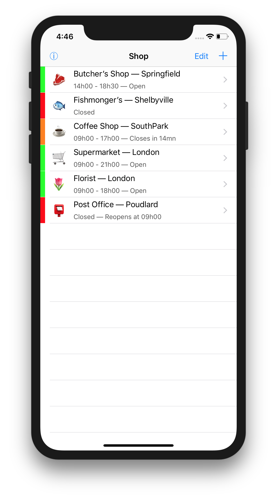
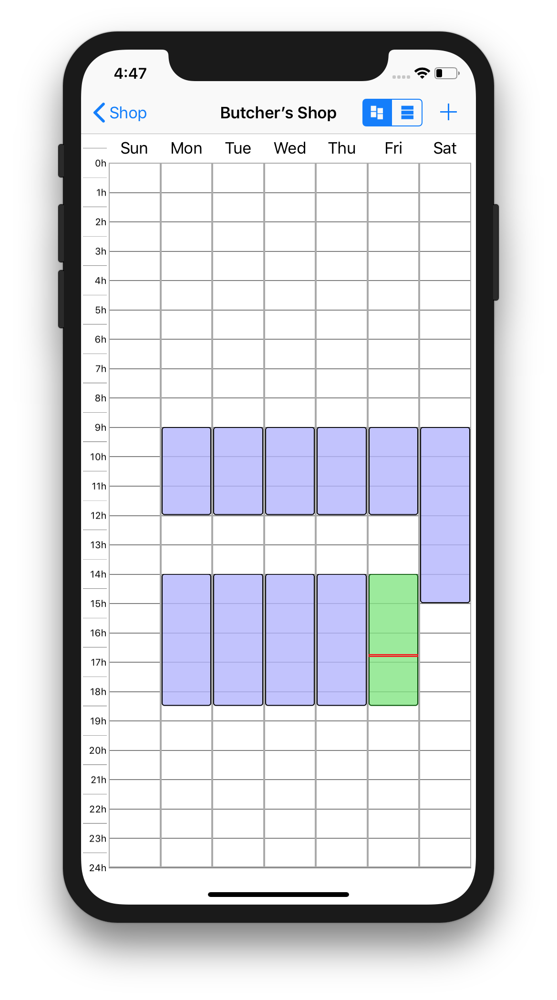
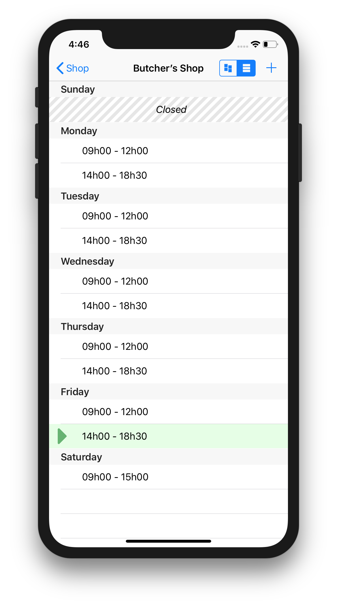

<table><tr height="80px">
<td rowspan=2></td>
<td><h1>Opening Hours</h1></td>
</tr><tr height="40px">
<td><small>The iOS App to keep track of the Opening Hours of your favorite shops</small></td>
</tr></table>

This iOS project allows you to easily store a list of opening hours for your favorite shops.

It's quite simple (just a list of shop, for each a TimeTable listing opening hours — either as a simple list or as a schedule table), all stored locally, and obviously displaying for each shop if it's currently open).

But it's very handy.

## Screenshots

## Improvement Ideas

This is a toy project that I ended up using personally, but I didn't really planned to spend a lot of time on it. I just needed it because I was tired of looking at the opening hours of my shops online every time and wanted a quickly accessible list.

But if someone has time, here are some ideas to improve it that I never took the time to implement.

### Allow the modification of an existing TimeRange

Currently if you want to modify a TimeRange in a TimeTable, you have to delete the TimeRange and recreate one. It would be nice to be able to modify it in place instead.

This triggers some questions though, as the UI to create new TimeRanges to fill a TimeTable is designed such that you can add a TimeRanges for multiple Weekdays at once. Should we allow modifying the weekday when editing an existing TimeRange? Or even select multiple Weekdays for the TimeRange being edited?

_Note: If we implement this feature, it would also be cool to access it via the `UIMenuController` that appears when we tap on a TimeRange in the TimeTable view._

### Detect conflicts in TimeRanges

Currently, there's nothing preventing you to create conflicting and overlapping TimeRanges in your shops' TimeTables.

There's actually a method already ready to detect if two TimeRanges intersect, but it's not used yet.

The question that this feature raises is how to alert the user when we create new TimeRanges (or even modify existing TimeRanges if we implement the previous feature), since when creating TimeRanges we can create the TimeRange for multiple Weekdays at once.

* What if it conflicts with a TimeRange in some days, but not others? Do we create the non-conflicting TimeRanges anyway, and abort on the conflicting ones? Or check them all in advance before adding any of them, and add them all only if there's no conflict?
* What do we propose if there's a conflict? Is the only option to abort the creation of the TimeRange? Or can we offer a _merge_ strategy? And if so, do we ask for each conflicting TimeRange we try to create during the TimeRange creation UI?

### Save more often

Currently the shops are only saved to UserDefaults when the app goes in background. This means that if the app crashes after a change, we don't save the modifications between the last switch to forground and the crash.

We could imagine saving (by sending a `NSNotification` to the `ShopListViewController`?) every time we do a modification of a shop (changing its name/details/icon, changing its TimeTable to add TimeRanges, …)

### WatchApp

Add a companion WatchApp to display the list of all shops and an icon if they're open or not.
